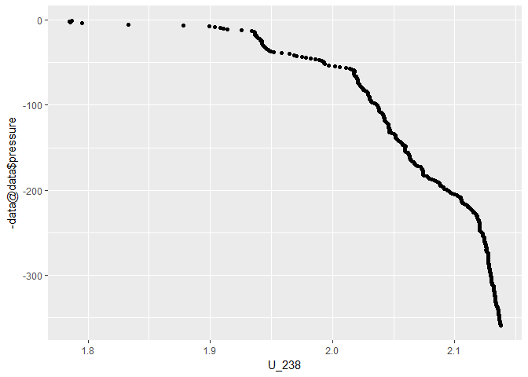

<!-- README.md is generated from README.Rmd. Please edit that file -->
marine
======

The goal of `marine` is to help marine science researchers analyze CTD data quickly without going through the whole complex data set.

Installation
============

To install the package, use the following code.

``` r
devtools::install_github("yuanjisun/marine")
#> Downloading GitHub repo yuanjisun/marine@master
#> from URL https://api.github.com/repos/yuanjisun/marine/zipball/master
#> Installing marine
#> "D:/R/R-3.4.2/bin/x64/R" --no-site-file --no-environ --no-save  \
#>   --no-restore --quiet CMD INSTALL  \
#>   "C:/Users/yuanj/AppData/Local/Temp/RtmpY9WXNH/devtools2ca40506d137b/yuanjisun-marine-163d6a2"  \
#>   --library="D:/R/R-3.4.2/library" --install-tests
#> 
```

To load the library, use the following code.

``` r
library(marine)
```

Example
-------

Step 1. import CTD data by calling `raw_data()`.

``` r
# data <- raw_data("sample_CTD.cnv")
```

Step 2. if you want to get the compensation depth, simply call `compensation_depth()`. The input is the raw data getting from Step 1.

``` r
compensation_depth(data)
#> [1] 32
```

Step 3. To get U-238 activity in the seawater and a depth profile figure, simply call `U_238()`. The input is the raw data getting from Step 1. The first argument is the raw data. The second input is used to decide which method should be used. The default is 1 (Owen's), but you can choose 2 (Pates'). The last input is `TRUE/FALSE`, deciding whether you want an output of the depth profile figure. The default is `TRUE`.

``` r
# Owen's method plus figure
result <- U_238(data, 1)

result[1]
#> [[1]]
#>   [1] 1.786945 1.784956 1.785389 1.795025 1.832886 1.878286 1.899539
#>   [8] 1.904043 1.907949 1.910944 1.913939 1.925312 1.933958 1.935742
#>  [15] 1.936324 1.936411 1.936827 1.937535 1.938045 1.938415 1.938831
#>  [22] 1.940183 1.941024 1.941339 1.942038 1.942298 1.942541 1.942604
#>  [29] 1.943060 1.943689 1.944200 1.944664 1.945520 1.946314 1.947642
#>  [36] 1.948405 1.949663 1.952021 1.958702 1.964895 1.968550 1.970657
#>  [43] 1.975231 1.978462 1.982439 1.985779 1.989245 1.991438 1.992476
#>  [50] 1.992908 1.993262 1.993946 1.997145 2.002199 2.005940 2.010994
#>  [57] 2.014177 2.015883 2.017479 2.018430 2.017887 2.017251 2.017549
#>  [64] 2.017754 2.018375 2.019302 2.019617 2.020096 2.020371 2.020450
#>  [71] 2.020599 2.020748 2.020851 2.020961 2.021181 2.021778 2.022556
#>  [78] 2.023248 2.024065 2.024891 2.025197 2.025449 2.026557 2.028035
#>  [85] 2.028451 2.029127 2.029269 2.029363 2.029819 2.030416 2.030416
#>  [92] 2.030518 2.030613 2.031021 2.031438 2.031800 2.032436 2.034362
#>  [99] 2.035572 2.036240 2.036893 2.037294 2.037639 2.037765 2.037891
#> [106] 2.038072 2.038339 2.038936 2.039911 2.040642 2.041051 2.041381
#> [113] 2.041758 2.042018 2.042505 2.042843 2.042835 2.042882 2.043016
#> [120] 2.043668 2.044564 2.045020 2.045492 2.045688 2.045900 2.046026
#> [127] 2.046333 2.046513 2.047009 2.047229 2.046686 2.046741 2.048219
#> [134] 2.050208 2.051174 2.051410 2.051654 2.051803 2.052196 2.053069
#> [141] 2.053391 2.053980 2.055167 2.055804 2.056614 2.057604 2.057423
#> [148] 2.059254 2.059671 2.059309 2.059176 2.059239 2.059215 2.059113
#> [155] 2.060080 2.061723 2.062053 2.062171 2.062477 2.063098 2.063232
#> [162] 2.063381 2.063562 2.063860 2.064387 2.064898 2.066328 2.067004
#> [169] 2.066981 2.067452 2.068018 2.069465 2.072263 2.072954 2.073387
#> [176] 2.073685 2.073819 2.073843 2.073913 2.073961 2.074071 2.074361
#> [183] 2.074951 2.077120 2.078008 2.079109 2.080972 2.082787 2.084619
#> [190] 2.085593 2.086741 2.087315 2.087802 2.088234 2.088329 2.089523
#> [197] 2.090592 2.091150 2.093060 2.094176 2.094986 2.095686 2.096794
#> [204] 2.098138 2.099851 2.101447 2.102209 2.103616 2.104685 2.105157
#> [211] 2.105534 2.105660 2.105731 2.105919 2.106438 2.107774 2.109024
#> [218] 2.110203 2.110682 2.110989 2.111814 2.113449 2.114219 2.114778
#> [225] 2.114880 2.115265 2.116444 2.117253 2.117843 2.118032 2.118149
#> [232] 2.118362 2.118637 2.118928 2.119431 2.119784 2.119957 2.120130
#> [239] 2.120091 2.120154 2.120185 2.120232 2.120280 2.120374 2.120390
#> [246] 2.120500 2.120618 2.120853 2.121749 2.122480 2.122755 2.122944
#> [253] 2.123093 2.123203 2.123549 2.124068 2.124194 2.124241 2.124225
#> [260] 2.124477 2.124760 2.124901 2.125051 2.125286 2.125349 2.125538
#> [267] 2.125671 2.125821 2.125829 2.125758 2.125797 2.125954 2.126984
#> [274] 2.127471 2.127511 2.127526 2.127526 2.127511 2.127519 2.127471
#> [281] 2.127440 2.127440 2.127448 2.127566 2.127644 2.127699 2.127872
#> [288] 2.127967 2.127990 2.128084 2.128250 2.128289 2.128391 2.128705
#> [295] 2.128698 2.128729 2.129028 2.129224 2.129240 2.129358 2.129546
#> [302] 2.129696 2.129712 2.129735 2.129782 2.129924 2.130167 2.130277
#> [309] 2.130372 2.130608 2.130725 2.131291 2.131739 2.131889 2.131912
#> [316] 2.132038 2.132085 2.132156 2.132274 2.132360 2.132408 2.132565
#> [323] 2.132753 2.132832 2.132958 2.133013 2.133099 2.133131 2.133131
#> [330] 2.133178 2.133366 2.133571 2.133775 2.133932 2.134113 2.134270
#> [337] 2.134703 2.135009 2.135151 2.135308 2.135552 2.135701 2.135756
#> [344] 2.135787 2.135819 2.135905 2.136086 2.136220 2.136259 2.136290
#> [351] 2.136314 2.136361 2.136558 2.136723 2.136801 2.136943 2.137202
#> [358] 2.137383 2.137524
result[2]
#> [[1]]
```



``` r

# Pates' method without figure
U_238(data, 2, FALSE)
#>   [1] 1.906726 1.904922 1.905314 1.914056 1.948401 1.989584 2.008863
#>   [8] 2.012949 2.016492 2.019209 2.021925 2.032243 2.040086 2.041704
#>  [15] 2.042232 2.042310 2.042688 2.043330 2.043793 2.044128 2.044506
#>  [22] 2.045732 2.046495 2.046781 2.047415 2.047650 2.047871 2.047929
#>  [29] 2.048342 2.048912 2.049376 2.049797 2.050574 2.051294 2.052499
#>  [36] 2.053190 2.054331 2.056470 2.062531 2.068149 2.071465 2.073375
#>  [43] 2.077525 2.080456 2.084063 2.087094 2.090238 2.092227 2.093168
#>  [50] 2.093561 2.093881 2.094502 2.097404 2.101988 2.105382 2.109967
#>  [57] 2.112854 2.114402 2.115849 2.116712 2.116220 2.115642 2.115913
#>  [64] 2.116098 2.116662 2.117503 2.117788 2.118223 2.118473 2.118544
#>  [71] 2.118680 2.118815 2.118908 2.119007 2.119207 2.119749 2.120455
#>  [78] 2.121082 2.121824 2.122572 2.122851 2.123079 2.124084 2.125424
#>  [85] 2.125802 2.126416 2.126544 2.126629 2.127043 2.127585 2.127585
#>  [92] 2.127678 2.127763 2.128134 2.128512 2.128840 2.129417 2.131164
#>  [99] 2.132262 2.132868 2.133460 2.133824 2.134137 2.134251 2.134365
#> [106] 2.134529 2.134772 2.135314 2.136198 2.136861 2.137232 2.137531
#> [113] 2.137873 2.138109 2.138551 2.138857 2.138850 2.138893 2.139014
#> [120] 2.139606 2.140419 2.140832 2.141260 2.141438 2.141631 2.141745
#> [127] 2.142023 2.142187 2.142636 2.142836 2.142344 2.142394 2.143734
#> [134] 2.145538 2.146415 2.146629 2.146850 2.146986 2.147342 2.148134
#> [141] 2.148426 2.148961 2.150037 2.150615 2.151349 2.152248 2.152084
#> [148] 2.153745 2.154123 2.153795 2.153674 2.153731 2.153709 2.153617
#> [155] 2.154493 2.155984 2.156283 2.156390 2.156668 2.157231 2.157353
#> [162] 2.157488 2.157652 2.157923 2.158401 2.158864 2.160162 2.160775
#> [169] 2.160754 2.161181 2.161695 2.163007 2.165545 2.166172 2.166565
#> [176] 2.166836 2.166957 2.166978 2.167042 2.167085 2.167185 2.167449
#> [183] 2.167983 2.169951 2.170757 2.171755 2.173445 2.175092 2.176753
#> [190] 2.177637 2.178678 2.179199 2.179641 2.180033 2.180119 2.181202
#> [197] 2.182172 2.182678 2.184411 2.185423 2.186158 2.186792 2.187798
#> [204] 2.189017 2.190571 2.192019 2.192710 2.193987 2.194956 2.195384
#> [211] 2.195726 2.195840 2.195905 2.196076 2.196546 2.197758 2.198892
#> [218] 2.199962 2.200396 2.200674 2.201423 2.202906 2.203605 2.204111
#> [225] 2.204204 2.204553 2.205623 2.206357 2.206892 2.207063 2.207170
#> [232] 2.207362 2.207612 2.207876 2.208332 2.208653 2.208810 2.208967
#> [239] 2.208931 2.208988 2.209017 2.209059 2.209102 2.209188 2.209202
#> [246] 2.209302 2.209409 2.209623 2.210435 2.211099 2.211348 2.211519
#> [253] 2.211655 2.211755 2.212068 2.212539 2.212653 2.212696 2.212681
#> [260] 2.212910 2.213166 2.213295 2.213430 2.213644 2.213701 2.213872
#> [267] 2.213993 2.214129 2.214136 2.214072 2.214107 2.214250 2.215184
#> [274] 2.215626 2.215662 2.215676 2.215676 2.215662 2.215669 2.215626
#> [281] 2.215598 2.215598 2.215605 2.215712 2.215783 2.215833 2.215990
#> [288] 2.216075 2.216097 2.216182 2.216332 2.216368 2.216460 2.216746
#> [295] 2.216738 2.216767 2.217038 2.217216 2.217230 2.217337 2.217508
#> [302] 2.217644 2.217658 2.217680 2.217722 2.217851 2.218072 2.218172
#> [309] 2.218257 2.218471 2.218578 2.219091 2.219498 2.219633 2.219655
#> [316] 2.219769 2.219811 2.219876 2.219983 2.220061 2.220104 2.220246
#> [323] 2.220417 2.220489 2.220603 2.220653 2.220731 2.220760 2.220760
#> [330] 2.220802 2.220974 2.221159 2.221344 2.221487 2.221651 2.221794
#> [337] 2.222186 2.222464 2.222592 2.222735 2.222956 2.223091 2.223141
#> [344] 2.223170 2.223198 2.223277 2.223441 2.223562 2.223597 2.223626
#> [351] 2.223647 2.223690 2.223868 2.224018 2.224089 2.224218 2.224453
#> [358] 2.224617 2.224745
```

Step 4. To get the GPS information of the sampling site, simply call `gps()`. The input is the raw data getting from Step 1. It will return a list containing latitute and longitude.

``` r
gps(data)
#> $longitude
#> [1] -123.6664
#> 
#> $latitude
#> [1] 49.25022
```
